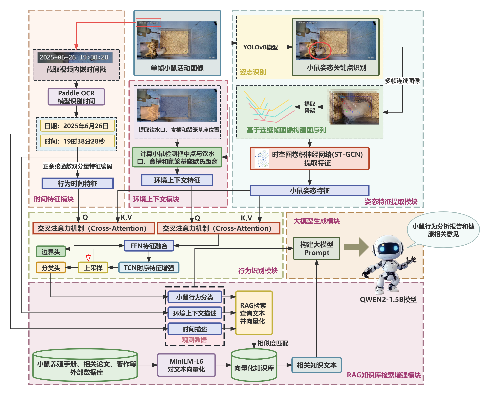
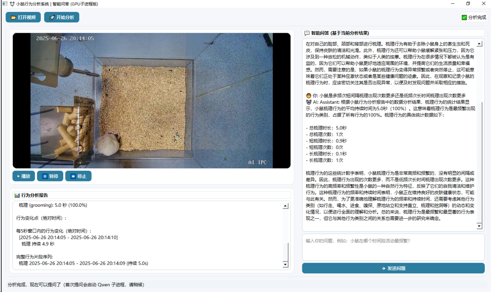

# MouseBehavior-STGCN-RAG

基于 ST-GCN 与大语言模型的小鼠行为时空分析与智能健康诊断系统

[](https://www.python.org/downloads/)
[](https://pytorch.org/)
[](LICENSE)

> 从视频中自动识别小鼠 9 种精细行为，并通过 RAG 增强的大语言模型生成专业健康诊断报告。

## 核心功能

- 🐭 **骨骼关键点提取**：YOLOv8n-Pose 实时提取 6 个关键点
- 🧠 **姿态时空建模**：双流 ST-GCN（关节流+骨骼流），全连接图 + 行归一化
- ⏱️ **多模态融合**：正弦-余弦时间编码 + 环境距离编码 + 双重交叉注意力
- 🎯 **行为识别**：行走、静止、饮水、饮食、嗅探、原地站立、靠墙站立、理毛、挖洞（准确率 **86.72%**）
- 📄 **智能诊断**：ChromaDB 知识库 + Qwen2-1.5B-Instruct 生成健康报告
- 🖥️ **图形界面**：PyQt5 视频播放、行为展示、多轮问答

## 系统架构

下图展示了从视频输入到诊断报告输出的整体流程：



## 界面演示

右侧智能问答区支持多轮次交互：



## 快速开始

```bash
# 克隆仓库
git clone https://github.com/yyx-35/MouseBehavior-STGCN-RAG.git
cd MouseBehavior-STGCN-RAG

# 安装依赖
pip install -r requirements.txt

#进入代码路径
cd mouse-st-gcn-rag

# 运行图形界面
python UI_pipeline_RAG.py
